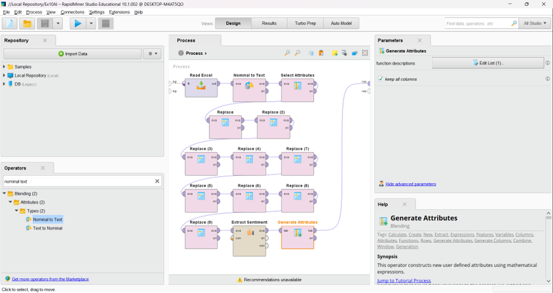
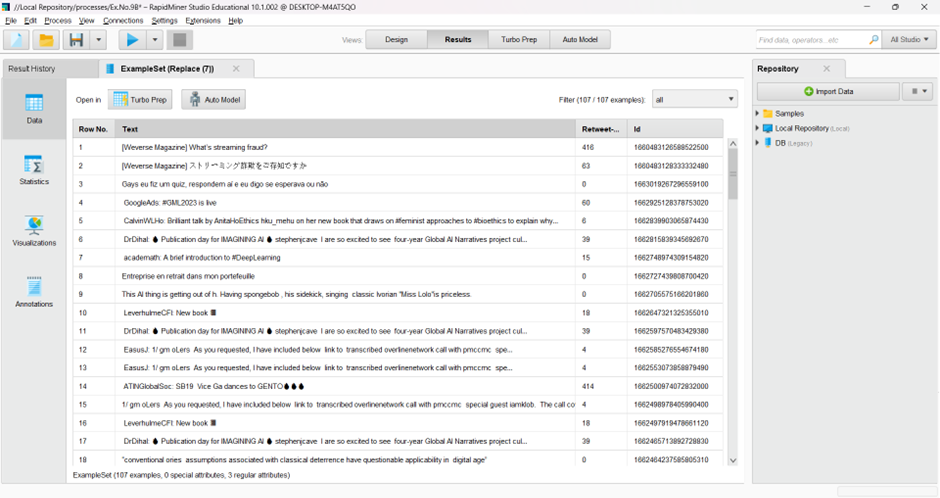
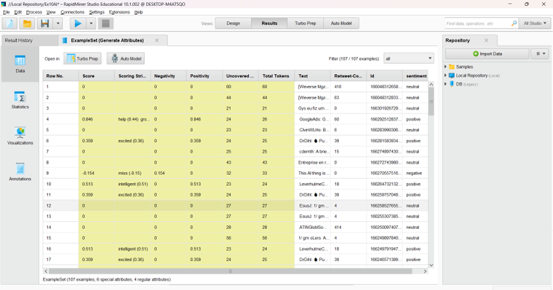

### EX10  Sentimental Analysis on Any Dataset Using Rapidminer

### AIM: 
To create a project for Sentimental Analysis on Any Dataset a Using Rapidminer
### Description: 
<div align = "justify">

### Procedure:
1) ***Import Excel data***
    <p>a. Drag the "Read Excel" operator from the IO folder onto the process canvas.
    <p>b. Double-click on the operator to open its configuration panel.
    <p>c. Specify the path to the Excel file you want to analyze.
    <p>d. Configure options such as sheet selection, header inclusion, etc.
    <p>e. Click on the "Run" button to execute the operator and import the Excel data.
2) ***Perform sentiment analysis with Generate Attributes operator***
    <p>a. Drag the "Generate Attributes" operator from the Operators panel onto the canvas.
    <p>b. Connect the output of the "Extract Sentiment" operator to the input of the "Generate Attributes" operator.
    <p>c. Double-click on the "Generate Attributes" operator to configure it.
    <p>d. Specify a name for the new sentiment attribute you want to generate (e.g., "Sentiment").
    <p>e. Choose the sentiment analysis algorithm, "VADER."
    <p>f. Click on the "Run" button to perform sentiment analysis on the Excel data and generate the sentiment attribute.
3) ***Interpret and export the results***
    <p>a. Analyze the sentiment analysis results from the generated visualizations.
    <p>b. If desired, drag the "Write Excel" operator onto the canvas to export the sentiment analysis results to a new Excel file.
    <p>c. Connect the output of the visualization operator(s) to the input of the "Write Excel" operator.
    <p>d. Configure the file path and other settings for the Excel export.
    <p>e. Click on the "Run" button to export the sentiment analysis results to a new Excel file.


    

### Output:
```
Name: Senthil Kumar S
Reg No: 212221230091
```







### Result:
Thus sentimental analysis for twitter data using Rapidminer is done successfully.
